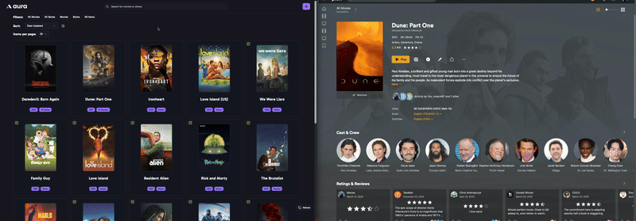

# 

**AURA** (Automated Utility for Retrieval of Assets) is a visual tool for managing Mediux image assets for your media server. It provides a sleek and intuitive interface to browse, preview, and apply image sets to your library content across platforms like Plex, Emby, and Jellyfin.

> **Note:** This tool is currently in beta. While it has been tested locally, please use it at your own risk.

---

## Key Features

-   🧩 **Cross-Server Compatibility**: Works with Plex, Emby, and Jellyfin.
-   🖼 **Visual Browsing**: Preview artwork in a clean, organized interface.
-   🔁 **Automated Updates**: Save selected image sets and keep them synced automatically.
-   🗄 **Local Storage**: Option to store images next to your media files for easy access.
-   📦 **Docker Support**: Easily deploy using Docker or docker-compose.

---

## Demo

#### Check out the demo of AURA in action! You can see how it looks and works before installing.

Movie being processed and the results in Plex

Series being processed and the results in Plex

---

## Getting Started

To get started with AURA:

1. Install using Docker or docker-compose.
2. Visit the web UI at `http://localhost:3000`.
3. Browse your media server's contents.
4. Choose and apply Mediux image sets.
5. Optionally save selections for automatic updates.

> Visit the [Docs](https://mediux-team.github.io/AURA/) for detailed steps.

---

## Join the Community

-   💬 [Join our Discord](https://discord.gg/YAKzwKPwyw)

---
