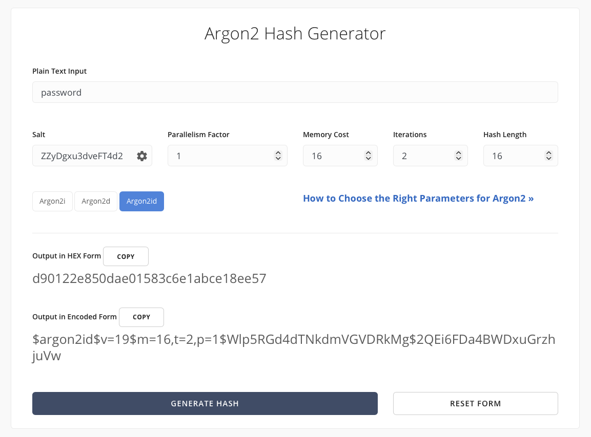

# Configuration

aura uses a `config.yaml` file for configuration. You can setup the configuration file during the onboarding process. However, if you would like, below are the instructions for creating and modifying the `config.yaml` file.

1. **Create the `config.yaml` File**:

    - You can create a new file named `config.yaml` in the root directory of your aura installation.

2. **Edit the `config.yaml` File**:

    - Open `config.yaml` in your preferred text editor.
    - Modify the configuration settings according to your needs. Be sure to replace all placeholder values (e.g., `YOUR_API_KEY_HERE`, `YOUR_SERVER_URL`) with your actual credentials and URLs.

3. **Place the `config.yaml` File**:

    - Place your configuration file in the `/config` directory on your Docker container.

> **Note:** Always keep your configuration file secure and do not share sensitive information publicly.

---

# Configuration Options

## Authentication

-   **Example**:

```yaml
Auth:
    Enable: true
    Password: YOUR_ARGON2ID_HASH_HERE
```

While this password authentication method is effective, it is important to keep your password secure and not share it with others. For enhanced security, consider using solutions like [Authentik](https://goauthentik.io/), [Authelia](https://www.authelia.com/) or [Tinyauth](https://tinyauth.app/).  
**I am not a security expert** 😅

### Enable

-   **Default**: `false`
-   **Options**: `true` or `false`
-   **Description**: Whether to enable authentication.
-   **Details**: If set to `true`, you will be required to authenticate before accessing the application.

### Password

-   **Default**: `null`
-   **Options**: Any valid Argon2id hash
-   **Description**: The password hash used to authenticate user.
-   **Details**: This password is used to authenticate user when they log in to the application. It is recommended to use a strong, unique password for this purpose. You can generate a new Argon2id hash using tools like [Argon2 Online](https://argon2.online/). You can use the default settings.
    
-   **Note**: Replace `YOUR_ARGON2ID_HASH_HERE` with the actual Argon2id hash of your desired password.

---

## Logging

-   **Example**:

```yaml
Logging:
    Level: DEBUG
```

### Level

-   **Default**: `TRACE`
-   **Options**: `TRACE`, `DEBUG`, `INFO`, `WARN`, `ERROR`
-   **Description**: The logging level for aura.
-   **Details**:
    -   `TRACE`: Most detailed logging, useful for debugging.
    -   `DEBUG`: Less detailed than TRACE, but still provides useful information for debugging.
    -   `INFO`: General information about the application's operation.
    -   `WARN`: Indicates potential issues that are not necessarily errors.
    -   `ERROR`: Indicates errors that occur during the application's operation.
-   **Note**: The logging level can be adjusted based on your needs. For production environments, it is recommended to use `INFO` or `WARN` to reduce log verbosity. If you run into issues, you can temporarily set it to `DEBUG` or `TRACE` for more detailed logs.

---

## MediaServer

-   **Example for Plex**:

```yaml
MediaServer:
    Type: Plex
    URL: YOUR_PLEX_SERVER_URL_HERE
    Token: YOUR_PLEX_API_TOKEN_HERE
    Libraries:
        - Name: 4K Movies
        - Name: Movies
        - Name: 4K Series
        - Name: Series
```

-- **Example for Emby**:

```yaml
MediaServer:
    Type: Emby
    URL: YOUR_EMBY_SERVER_URL_HERE
    Token: YOUR_EMBY_API_TOKEN_HERE
    Libraries:
        - Name: Movies
        - Name: TV Shows
```

-- **Example for Jellyfin**:

```yaml
MediaServer:
    Type: Jellyfin
    URL: YOUR_JELLYFIN_SERVER_URL_HERE
    Token: YOUR_JELLYFIN_API_TOKEN_HERE
    Libraries:
        - Name: Movies
        - Name: TV Shows
```

### Type

-   **Options**: `Plex`, `Emby`, `Jellyfin`
-   **Description**: The type of media server you are using.
-   **Details**: This option specifies the type of media server that aura will interact with. Depending on your choice, aura will use the appropriate API and methods to manage images and metadata.

### URL

-   **Description**: The URL of the media server.
-   **Details**: This option specifies the URL of the media server that aura will interact with.
-   **Note**: Replace `YOUR_PLEX_SERVER_URL_HERE`, `YOUR_EMBY_SERVER_URL_HERE`, or `YOUR_JELLYFIN_SERVER_URL_HERE` with the actual URL of your media server. Make sure to include the protocol (e.g., `http://` or `https://`) in the URL.
-   **Example**: `http://localhost:32400`, `https://my-emby-server.com`, or `http://jellyfin.example.com`.

### Token

-   **Description**: The authentication token for the media server.
-   **Details**: This option specifies the authentication token required to access the media server's API. You can obtain this token from your media server's settings or API documentation.
-   **Note**: The token is necessary for aura to authenticate and perform actions on your media server. Make sure to keep this token secure and do not share it publicly.

### Libraries

-   **Description**: The name of the media server library to use.
-   **Details**: This option specifies the name of the library on your media server that aura will interact with. aura will use this library to manage images and metadata.
-   **Note**: Ensure that the library name matches exactly with the name on your media server, including case sensitivity. Only show and movies libraries are supported.

---

## Mediux

-   **Example**:

```yaml
Mediux:
    Token: YOUR_MEDIUX_API_TOKEN_HERE
    DownloadQuality: optimized
```

### Token

-   **Description**: The API token for MediUX.
-   **Details**: This option specifies the API token required to access MediUX's API. This can be obtained by creating an account on [MediUX](https://mediux.io/) and generating an API token in your account settings.
-   **Note**: This is not yet available to the public, but will be in the future.
    If you would like to test out aura, please contact us on [Discord](https://discord.gg/YAKzwKPwyw) to get access to the API token.

### DownloadQuality

-   **Default**: `optimized`
-   **Options**: `optimized`, `original`
-   **Description**: The quality of images to download from MediUX.
-   **Details**: This option specifies the quality of images to download from MediUX.
    -   `optimized`: Downloads images that are optimized for space savings and performance.
    -   `original`: Downloads the original images without any optimization.

---

## AutoDownload

-   **Example**:

```yaml
AutoDownload:
    Enabled: true
    Cron: "0 0 * * *"
```

### Enabled

-   **Default**: `false`
-   **Options**: `true` or `false`
-   **Description**: Whether to automatically download images from updated sets.
-   **Details**: When downloading images, you have the option to saved sets for "Automatic Downloads". If this option is enabled, aura will automatically download images from sets that have been updated. This is useful for keeping your media library up-to-date with the latest images without manual intervention.
-   **Note**: Enabling this option may result in increased network usage as aura will periodically check for updates and download new images.

### Cron

-   **Default**: `0 0 * * *`
-   **Options**: Cron expression
-   **Description**: The cron expression for scheduling automatic downloads.
-   **Details**: This cron expression determines how often aura checks for updates and downloads images. The default value `0 0 * * *` means that aura will check for updates every day at midnight. You can modify this expression to change the frequency of automatic downloads according to your needs.
    **Note**: Make sure to use a valid cron expression. You can use online tools like [crontab.guru](https://crontab.guru/) to help you create and validate cron expressions.

---

## Images

-   **Example**:

```yaml
Images:
    CacheImages:
        Enabled: false
    SaveImagesLocally:
        Enabled: false
        Path: ""
        EpisodeNamingConvention: "match"
```

## CacheImages.Enabled

-   **Default**: `false`
-   **Options**: `true` or `false`
-   **Description**: Whether to cache images locally.
-   **Details**: If set to `true`, aura will cache images to reduce load times and improve performance. This is particularly useful for frequently accessed images.Keep in mind that enabling this option will increase disk space usage as images will be stored locally.

## SaveImagesLocally.Enabled

-   **Default:** `false`
-   **Options:** `true` or `false`
-   **Description:** Whether to save images locally.
-   **Details:**
    -   If `true`, images are saved in the same directory as the Media Server content.
    -   If `false`, images are updated on the Media Server but not saved next to the content.
    -   For **Emby** or **Jellyfin**, this option is ignored (handled by the server).
    -   For **Plex**, this option determines if images are saved next to content.

## SaveImagesLocally.Path

-   **Default:** `""` (empty string)
-   **Options:** Any valid file path
-   **Description:** The path where images should be saved if `SaveImagesLocally.Enabled` is `true`.
-   **Details:**
    -   If set to a valid path, images will be saved to that directory.
    -   If left empty, images will be saved next to the media content.
    -   Ensure the specified path is added to your docker volume mounts.
    -   Ensure the specified path is writable by the application.

## SaveImagesLocally.EpisodeNamingConvention

-   **Default:** `"match"`
-   **Options:** `"match"` or `"static"`
-   **Description:** The naming convention for episode images when saving locally.
-   **Details:**
    -   `"match"`: Episode images will match the episode file name.
    -   `"static"`: Episode images will use a static naming format like `S01E01.jpg` or `S1E1.jpg`.
-   **Note:** This option is only applicable when using Plex as the Media Server.

---

## Labels and Tags

Aura supports adding and removing labels (tags) on Plex items after processing. This is useful for organizing your media library, marking items for automation, or integrating with other tools.

-   **Example**:

```yaml
LabelsAndTags:
    Applications:
        - Application: Plex
          Enabled: true
          Add:
              - "Overlay"
              - "4K"
          Remove:
              - "OldLabel"
          AddLabelTagForSelectedTypes: true
```

### Applications

-   **Description**:  
    An array of label/tag configuration blocks, one per supported application.
-   **Fields**:
    -   `Application`: The name of the application (e.g., `Plex`, `Sonarr` or `Radarr`).
    -   `Enabled`: Set to `true` to enable label/tag management for this application.
    -   `Add`: A list of labels/tags to add to items after processing.
    -   `Remove`: A list of labels/tags to remove from items after processing.
    -   `AddLabelTagForSelectedTypes`: A boolean to add labels in Plex and tags in Sonarr/Radarr for each selected type (e.g., aura-poster, aura-backdrop).

#### Example Use Case

If you want Aura to add the labels `Overlay` and `aura` to your Plex items, and remove the label `OldLabel`, your config would look like:

```yaml
LabelsAndTags:
    Applications:
        - Application: Plex
          Enabled: true
          Add:
              - "Overlay"
              - "aura"
          Remove:
              - "OldLabel"
          AddLabelTagForSelectedTypes: true
        - Application: Sonarr
          Enabled: true
          Add:
              - aura
          Remove:
              - "some-old-label"
          AddLabelTagForSelectedTypes: true
        - Application: Radarr
          Enabled: true
          Add:
              - aura
          Remove:
              - "some-old-label"
```

#### Notes

-   You can leave `Add` or `Remove` empty if you only want to add or only want to remove labels.
-   Only applications with `Enabled: true` will be processed.
-   This structure is extensible for future support of other applications (such as Sonarr or Radarr).
-   Any tags for Sonarr/Radarr have to be in lowercase.

---

## Notifications

Configure one or more providers. Notifications can be disabled globally or per provider.

Example:

```yaml
Notifications:
    Enabled: true # Master switch (false = ignore all providers)
    Providers:
        - Provider: "Discord"
          Enabled: true
          Discord:
              Webhook: YOUR_DISCORD_WEBHOOK_URL
        - Provider: "Pushover"
          Enabled: true
          Pushover:
              Token: YOUR_PUSHOVER_APP_TOKEN
              UserKey: YOUR_PUSHOVER_USER_KEY
        - Provider: "Gotify"
          Enabled: true
          Gotify:
              URL: YOUR_GOTIFY_SERVER_URL
              Token: YOUR_GOTIFY_APP_TOKEN
        - Provider: "Webhook"
          Enabled: true
          Webhook:
              URL: YOUR_WEBHOOK_URL
              Headers:
                  Some-Header: "HeaderValue"
                  Another-Header: "AnotherValue"
```

### Structure

-   Notifications.Enabled  
    Global on/off. If false, Providers are loaded but not used.
-   Notifications.Providers[]  
    Array of provider entries.

### Provider Entry Fields

| Field            | Required                               | Notes                                        |
| ---------------- | -------------------------------------- | -------------------------------------------- |
| Provider         | yes                                    | Case-sensitive. Supported: Discord, Pushover |
| Enabled          | yes                                    | If false, entry kept but skipped             |
| Discord.Webhook  | yes (when Provider=Discord & Enabled)  | Full Discord webhook URL                     |
| Pushover.Token   | yes (when Provider=Pushover & Enabled) | Your app token                               |
| Pushover.UserKey | yes (when Provider=Pushover & Enabled) | Your user key                                |
| Gotify.URL       | yes (when Provider=Gotify & Enabled)   | Base URL for your Gotify server              |
| Gotify.Token     | yes (when Provider=Gotify & Enabled)   | Your Gotify app token                        |

**Note**: Replace any `YOUR_...` placeholders with your actual configuration values. For URL fields, ensure you include the full URL with the appropriate protocol (e.g., `http://` or `https://`).

---

## Sonarr and Radarr Integration

-   **Example**:

```yaml
SonarrRadarr:
    Applications:
        - Type: Sonarr
          Library: Series
          URL: YOUR_SONARR_URL
          APIKey: YOUR_SONARR_API_TOKEN
        - Type: Sonarr
          Library: 4K Series
          URL: YOUR_SONARR_URL
          APIKey: YOUR_SONARR_API_TOKEN
        - Type: Radarr
          Library: Movies
          URL: YOUR_RADARR_URL
          APIKey: YOUR_RADARR_API_TOKEN
        - Type: Radarr
          Library: 4K Movies
          URL: YOUR_RADARR_URL
          APIKey: YOUR_RADARR_API_TOKEN
```

Aura can interact with Sonarr and Radarr to add tags to your Sonarr/Radarr items after processing. This is useful for organizing your media library, marking items for automation, or integrating with other tools.

> **Note**: aura also supports a custom webhook integration from Sonarr to aura to redownload titlecards when an episode file is upgraded. View the [documentation](https://mediux-team.github.io/AURA/sonarr-webhook-integration) for more details.

### Type

-   **Options**: `Sonarr`, `Radarr`
-   **Description**: The type of application you are configuring.
-   **Details**: This option specifies whether you are configuring Sonarr or Radarr. Depending on your choice, aura will use the appropriate API and methods to manage tags.

### URL

-   **Description**: The URL of the Sonarr or Radarr server.
-   **Details**: This option specifies the URL of the Sonarr or Radarr server that aura will interact with.
-   **Note**: Replace `YOUR_SONARR_URL` or `YOUR_RADARR_URL` with the actual URL of your Sonarr or Radarr server. Make sure to include the protocol (e.g., `http://` or `https://`) in the URL.
-   **Example**: `http://localhost:8989`, `https://my-sonarr-server.com`, or `http://my-radarr-server.com`.

### APIKey

-   **Description**: The API key for the Sonarr or Radarr server.
-   **Details**: This option specifies the API key required to access the Sonarr or Radarr server's API. You can obtain this key from your Sonarr or Radarr server's settings.
-   **Note**: The API key is necessary for aura to authenticate and perform actions on your Sonarr or Radarr server. Make sure to keep this key secure and do not share it publicly.

---
