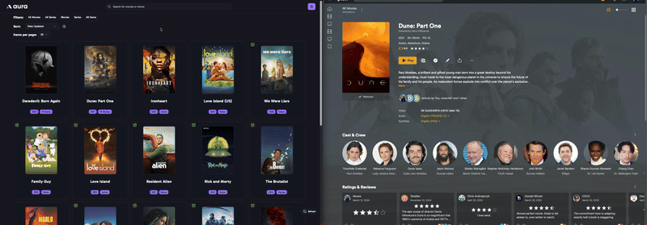

# 

**aura** (Automated Utility for Retrieval of Assets) is a visual tool for managing MediUX image assets for your media server. It provides a sleek and intuitive interface to browse, preview, and apply image sets to your library content across platforms like Plex, Emby, and Jellyfin.

> **Note:** This tool is currently in beta. While it has been tested locally, please use it at your own risk.

---

## Key Features

- 🧩 **Cross-Server Compatibility**: Works with Plex, Emby, and Jellyfin.
- 🖼 **Visual Browsing**: Preview artwork in a clean, organized interface.
- 🔁 **Automated Updates**: Save selected image sets and keep them synced automatically.
- 🗄 **Local Storage**: Option to store images next to your media files for easy access.
- 📦 **Docker Support**: Easily deploy using Docker or docker-compose.

---

## Demo

**Check out the demo of aura in action! You can see how it looks and works before installing.**

Movie being processed and the results in Plex

Series being processed and the results in Plex

---

## Getting Started

To get started with aura:

1. Install using Docker or docker-compose.
2. Configure your `config.yaml` file. You can use [configuration guide](/config.md) as a reference.
3. Visit the web UI at `http://localhost:3000`.
4. Browse your media server's contents.
5. Choose and apply MediUX image sets.
6. Optionally save selections for automatic updates.

> Visit the [Installation](installation) and [Usage](how-to-use) sections in the sidebar for detailed steps.

---

## Join the Community

- 💬 [Join our Discord](https://discord.gg/YAKzwKPwyw)
- 🛠 [View Source on GitHub](https://github.com/mediux-team/aura)

---
